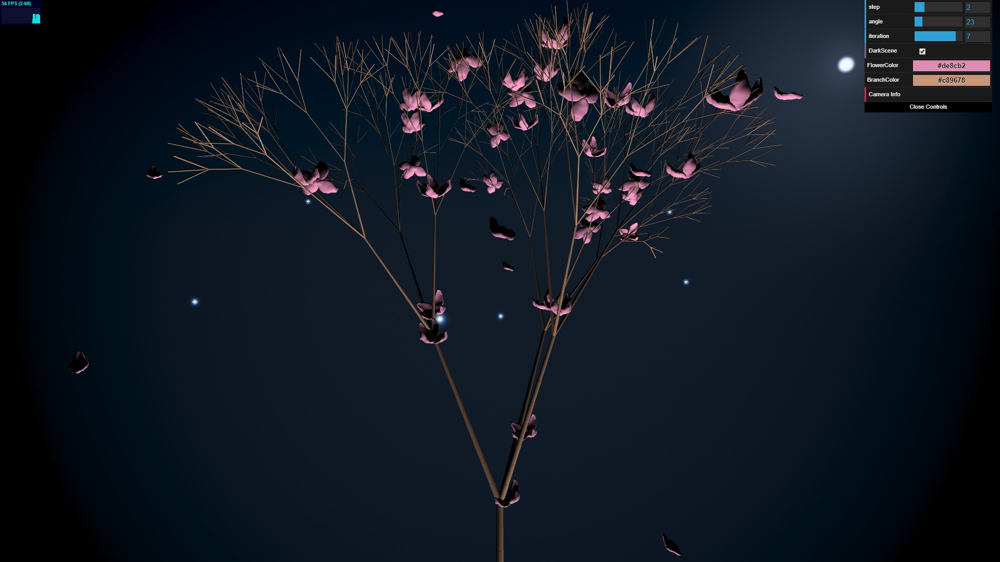
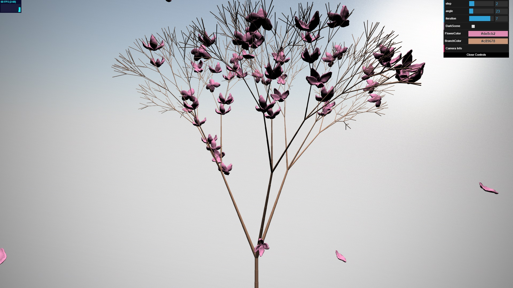

# Homework 4: L-systems

## [Demo Link](https://hanmingzhang.github.io/homework-4-l-systems-HanmingZhang/)

## ScreenShots

Night Scene | Day Scene
-------------- | --------------
 | 

## L-System
In terms of some L-System details and 3D L-System rules, I refer a lot from the paper [Graphical modeling using
L-systems](http://algorithmicbotany.org/papers/abop/abop-ch1.pdf). The tree drawing is a map of probabilities when there are several related rules for the same character. As a result, you can see a **slightly different tree and flowers everytime you refresh the page**. Also, as the tree grows higher, the branch will turns thinner, which I think is what happens to a real tree. Since everytime a tree is "draw", the mesh has to be reconstructed, so **it may take a while to load the page or change the L-system parameter in the GUI panel**.

## Falling petals and "Fireflies"

Actually, I implemented another super simple particle system using WebGL 2.0 transform feedback. But so far, I'm still working on how to incoporate obj into that. So the falling petals are actually "keyframed" and the "Fireflies" refers a lot from iq's shadertoy project [Sphere-fog density](https://www.shadertoy.com/view/XljGDy)

__________________________________________

## L-System Components
The way you implement your L-System is ultimately up to you, but we recommend
creating the following classes / constructs to help you instantiate, expand, and
draw your grammars:
* Some sort of expandable collection of string characters. You might implement
a linked list data structure, or you might use a basic Javascript array (which
is resizeable).
* Some sort of class to represent a Rule for expanding a character into a
string. You might consider creating a map within each Rule that maps
probabilities to strings, so that a Rule can represent multiple possible
expansions for a character with different probabilities.
* A second Rule-style class that dictates what drawing operation should be
performed when a character is parsed during the drawing process. This should
also be a map of probabilities, but this time the values in the map will be
functions rather than strings. Invoke a given function, e.g. `drawBranch`, when
a character is parsed.
* A Turtle class that lets you keep track of, at minimum, a position, an
orientation, and a depth. You should also create a stack onto which you can push
and pop turtle states.
* A class in which to store the VBOs that will represent __all__ of your faceted
geometry. __Do not draw individual mesh components one at a time. This will
cause your program to render very slowly.__ Instead, expand lists of vertex
information as you "draw" your grammar, and push all VBO data to the GPU at once
after you've finished parsing your entire string for drawing.

## OBJ loading
So that you can more easily generate interesting-looking plants, we ask that you
enable your program to import OBJ files and store their information in VBOs. You
can either implement your own OBJ parser, or use an OBJ-loading package via NPM:

[obj-mtl-loader](https://www.npmjs.com/package/obj-mtl-loader)

[webgl-obj-loader](https://www.npmjs.com/package/webgl-obj-loader)

## Aesthetic Requirements
Your plant must have the following attributes:
* It must grow in 3D
* It must have flowers, leaves, or some other branch decoration in addition to
basic branch geometry
* Organic variation (i.e. noise or randomness in grammar expansion)
* A flavorful twist. Don't just make a basic variation on the example broccoli
grammar from the slides! Create a plant that is unique to you!

Feel free to use the resources linked in the slides for inspiration!

## Interactivity
Using dat.GUI, make at least three aspects of your demo an interactive variable.
For example, you could modify:

* The axiom
* Your input grammar rules and their probability
* The angle of rotation of the turtle
* The size or color or material of the cylinder the turtle draws

Don't feel restricted to these examples; make any attributes adjustable that you
want!

## Examples from last year (Click to go to live demo)

Andrea Lin:

Tabatha Hickman:

Joe Klinger:

## Extra Credit (Up to 20 points)
For bonus points, add functionality to your L-system drawing that ensures
geometry will never overlap. In other words, make your plant behave like a
real-life plant so that its branches and other components don't compete for the
same space. The more complex you make your L-system self-interaction, the more
points you'll earn.
